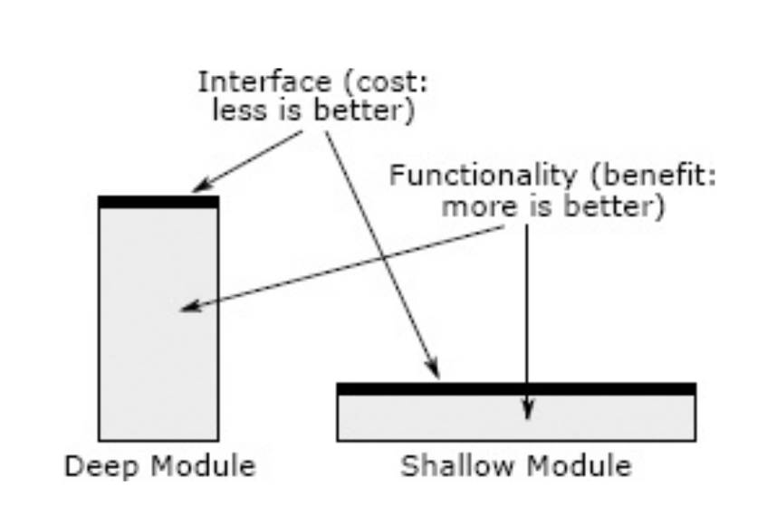
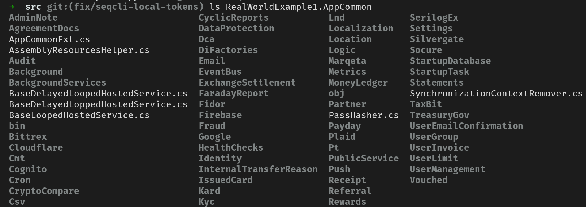

# Avant-garde Computer Programming

---

## Separation of Concerns

---

## How to achieve separation of concerns?

### Principles
### Intuition

---

## Principles

- **SOLID**: **SOLI**D **D**oesn't Mean Anything.
- **DDD**: **D**omain **D**riven **D**evelopment.

---

## SOLID

---

## Pervasive Layers

- Domain
- Infrastructure (data, external services)
- Presentation (API)

---

#### Dependency Inversion and Injection

```cs
class Employee { ... }

// A process in the business domain.
class SalaryPayout {
    private employees: IEmployeeStore;

    // Dependency Injection
    public SalaryPayout(employees: IEmployeeStore) { ... }

    public void Pay() {
        // Dependency Inversion
        foreach (Employee employee in employees.All()) {
            ...
        }
    }
}
```

---

#### Idiomatic C# and Rust

---

```rs
// Domain modules

mod employee {
    struct Employee { ... }
}

// `employee::Employee` suffers from "naming saturation"
pub use employee::Employee;

mod salary {
    // Might or might not do dependency inversion with a trait
    fn payout() {
        for employee in data::employees {
            ...
        }
    }
}

// Infrastructural modules

mod data {
    // Dependency Inversion
    fn employees() -> Vec<domain::Employee> {
        ...
    }
}
```

---

## DDD

---

### Data Transfer Objects (DTOs)

---

#### Programming Cults and Important Ideas

---

## Intuition

- Think
- Don't stop thinking

---

## Cognitive Complexity

- Interface complexity
- Implementation complexity

---

## Edge Cases

---

## Information hiding

---

## Interfaces



---

### Documentation

- Interface documentation
- Implementation documentation

---

## Testing

---

## Refactoring

---

## Computers Can Prove Ideas About Code

---

# Real World Examples: The Bad

---

## Real World Example 1

Integrating fiat and Bitcoin into a single digital payment system.

- _Seamless_ conversions between BTC and USD when sending and receiving money.
- BTC/USD exchange. (External)
- BTC/USD withdrawals and deposits.

---



---

### "External Balance Operations"

- `ExtBalanceWork`
- `ExtBalanceWorkExecutor`
- `ExtBalanceWorkFacade`
- `BalanceOperationFactory`
- `BalanceOperationFactoryProvider` (yes, this is a factory of factories)

---

### "Funds Auto Conversion"

- `FundsAutoConversionOperation`
- `FundsAutoConversionOperationFactory`
- `FundsAutoConversionOperationWorkRequestor`
- `FundsAutoConversionOperationWorkExecutor`
- `FundsConversionStrategy`

---

## `NightmareFactory`

---

### Anti-tests

- Set up a mock
- Call something to do some work on the mock
- Assert that methods were called on the mock

---

### Documentation

Can anybody tell me what an "external balance operation" is?

---

## Real World Example 2: WalletConnect

A protocol to connect dapps to digital wallets.

---

- "Services" which communicate through channels
- The original author wanted to write Erlang rather than Rust

Top level crates:

- `service_cache`
- `service_legacy`
- `service_notification`
- `service_prometheus`
- `service_subscription`
- `service_websocket`
- `websocket_types`

---

#### `websocket_types`?

```rs
/// An owned permission to write to a managed websocket
#[derive(Debug, Clone)]
pub struct SocketId {
    id: u64,
    handle: Option<Arc<mpsc::Sender<Message>>>,
}
```

---

_Every single service uses this type._

---

The services would otherwise form a dependency cycle.

---

```rs
/// Future returned from the [`add_websocket`] service method. See its documentation for more.
///
/// [`add_websocket`]: crate::WebSocketService::add_socket
#[derive(Debug)]
#[pin_project]
pub struct AddWebSocketFuture {
    #[pin]
    inner: FutureImpl<SocketId>,
}

impl AddWebSocketFuture {
    /// Creates a new future from the given parts. Library users should not directly invoke this
    /// method, instead call [`WebSocketService::add_socket`] with the appropriate arguments.
    ///
    /// [`WebSocketService::add_socket`]: crate::WebSocketService::add_socket
    pub fn new(
        socket_h: &mpsc::Sender<Request>,
        request: Request,
        response: oneshot::Receiver<SocketId>,
    ) -> Self {
        let inner = FutureImpl::new(socket_h, request, response);

        Self { inner }
    }
}
```

---

```rs
/// Internal implementation for driving request, response futures used by the WebSocketService.
/// Effectively boils down to a state machine which tracks our progress through the poll break
/// points.
#[derive(Debug)]
#[pin_project]
struct FutureImpl<T> {
    inner: Option<PollSender<Request>>,
    item: Option<Request>,
    #[pin]
    response: oneshot::Receiver<T>,
    state: State,
}
```

---

```rs
impl<T> FutureImpl<T> {
    pub fn new(
        handle: &mpsc::Sender<Request>,
        request: Request,
        response: oneshot::Receiver<T>,
    ) -> Self {
        let inner = Some(PollSender::new(handle.clone()));

        Self {
            inner,
            item: Some(request),
            response,
            state: State::Send,
        }
    }

    fn poll_impl(mut self: Pin<&mut Self>, cx: &mut Context<'_>) -> Poll<Result<T, ChannelError>> {
        let result = ready!(self.as_mut().poll_loop(cx));

        let this = self.project();
        *this.state = State::Done;

        Poll::Ready(result)
    }

    fn poll_loop(self: Pin<&mut Self>, cx: &mut Context<'_>) -> Poll<Result<T, ChannelError>> {
        let this = self.project();

        loop {
            // Our future's state machine
            match this.state {
                // Want to send our request
                State::Send => {
                    ready!(this.inner.as_mut().unwrap().poll_send_done(cx)).and_then(|_| {
                        let permit = this.inner.as_mut().unwrap();
                        let item = this.item.take().unwrap();

                        *this.state = State::Inflight;

                        permit.start_send(item)
                    })?
                }
                // Sent the request, waiting for acknowledgement
                State::Inflight => {
                    ready!(this.inner.as_mut().unwrap().poll_send_done(cx)).map(|_| {
                        this.inner.take();

                        *this.state = State::Response;
                    })?
                }
                // Sent the request, waiting for the response
                State::Response => {
                    let result = ready!(this.response.poll(cx))?;

                    return Poll::Ready(Ok(result));
                }
                // Future finished, calling a completed Future is not allowed
                State::Done => panic!("Polling a completed Future is not allowed"),
            }
        }
    }
}

impl<T> Future for FutureImpl<T> {
    type Output = Result<T, ChannelError>;

    fn poll(self: Pin<&mut Self>, cx: &mut Context<'_>) -> Poll<Self::Output> {
        self.poll_impl(cx)
    }
}
```

---

```rs
async fn add_websocket(websocket: &...) -> ... {
    let res = self.handle.send(websocket).await;
    res.channel.recv().await
}
```

---

## Real World Example 3: CoW Protocol

(Nobody is safe)

---

- Lack of design, everything just thrown together into a "shared" module
- Abundance of `u256` numbers without units
- Reusing API DTOs for domain logic

---

```rs
/// An order that is returned when querying the orderbook.
///
/// Contains extra fields that are populated by the orderbook.
#[derive(Eq, PartialEq, Clone, Debug, Default, Deserialize, Serialize)]
#[serde(rename_all = "camelCase")]
pub struct Order {
    #[serde(flatten)]
    pub metadata: OrderMetadata,
    #[serde(flatten)]
    pub data: OrderData,
    #[serde(flatten)]
    pub signature: Signature,
    #[serde(default)]
    pub interactions: Interactions,
}
```

---

#### `data` and `metadata`?

---

#### The "complete" order data?

```rs
/// The complete order data.
///
/// These are the exact fields that get signed and verified by the settlement
/// contract.
#[derive(Clone, Copy, Debug, Default, Deserialize, Eq, Hash, PartialEq, Serialize)]
#[serde(rename_all = "camelCase")]
pub struct OrderData {
    pub sell_token: H160,
    pub buy_token: H160,
    #[serde(default)]
    pub receiver: Option<H160>,
    #[serde(with = "u256_decimal")]
    pub sell_amount: U256,
    #[serde(with = "u256_decimal")]
    pub buy_amount: U256,
    pub valid_to: u32,
    pub app_data: AppId,
    #[serde(with = "u256_decimal")]
    pub fee_amount: U256,
    pub kind: OrderKind,
    pub partially_fillable: bool,
    #[serde(default)]
    pub sell_token_balance: SellTokenSource,
    #[serde(default)]
    pub buy_token_balance: BuyTokenDestination,
}
```

---

```rs
/// An order as provided to the orderbook by the frontend.
#[serde_as]
#[derive(Eq, PartialEq, Clone, Default, Derivative, Deserialize, Serialize)]
#[derivative(Debug)]
#[serde(rename_all = "camelCase")]
pub struct OrderMetadata {
    pub creation_date: DateTime<Utc>,
    pub owner: H160,
    pub uid: OrderUid,
    #[serde_as(as = "Option<DecimalU256>")]
    pub available_balance: Option<U256>,
    #[derivative(Debug(format_with = "debug_biguint_to_string"))]
    #[serde_as(as = "DisplayFromStr")]
    pub executed_buy_amount: BigUint,
    #[derivative(Debug(format_with = "debug_biguint_to_string"))]
    #[serde_as(as = "DisplayFromStr")]
    pub executed_sell_amount: BigUint,
    #[serde(default, with = "u256_decimal")]
    pub executed_sell_amount_before_fees: U256,
    #[serde(default, with = "u256_decimal")]
    pub executed_fee_amount: U256,
    pub invalidated: bool,
    pub status: OrderStatus,
    #[serde(flatten)]
    pub class: OrderClass,
    pub settlement_contract: H160,
    #[serde(default, with = "u256_decimal")]
    pub full_fee_amount: U256,
    #[serde(default, skip_serializing_if = "Option::is_none")]
    pub ethflow_data: Option<EthflowData>,
    #[serde(default, skip_serializing_if = "Option::is_none")]
    pub onchain_order_data: Option<OnchainOrderData>,
    #[serde(default, skip_serializing_if = "Option::is_none")]
    pub onchain_user: Option<H160>,
    pub is_liquidity_order: bool,
}
```

---

# Real World Examples: The Good

---

## `driver` and `solvers`

---

#### `driver` is a bad name.

---

```rs
mod boundary;
mod domain;
mod infra;
mod util;
```
---

#### `infra`

```rs
mod api;
mod blockchain;
mod config;
mod liquidity;
mod mempool;
mod simulator;
mod solver;
mod time;
```

---

```rs
impl Simulator {
    /// Simulate transactions on [Tenderly](https://tenderly.co/).
    pub fn tenderly(config: tenderly::Config, network_id: eth::NetworkId) -> Self { ... }

    /// Simulate transactions using the Ethereum RPC API.
    pub fn ethereum(eth: Ethereum) -> Self { ... }

    /// Simulate the access list needed by a transaction. If the transaction
    /// already has an access list, the returned access list will be a
    /// superset of the existing one.
    pub async fn access_list(&self, tx: eth::Tx) -> Result<eth::AccessList, Error> { ... }

    /// Simulate the gas needed by a transaction.
    pub async fn gas(&self, tx: eth::Tx) -> Result<eth::Gas, Error> { ... }
}
```

---

```rs
/// Ethereum transaction simulator.
#[derive(Debug, Clone)]
pub struct Simulator {
    inner: Inner,
    disable_access_lists: bool,
}

#[derive(Debug, Clone)]
enum Inner {
    Tenderly(tenderly::Tenderly),
    Ethereum(Ethereum),
}
```

---

#### `domain`

```rs
mod competition;
mod eth;
mod liquidity;
mod quote;
```

---

```rs
/// An ongoing competition. There is one competition going on per solver at any
/// time. The competition stores settlements to solutions generated by the
/// driver, and allows them to be executed onchain when requested later. The
/// solutions expire after a certain amount of time, at which point trying to
/// use them will return an `[Error::SolutionNotFound]`.
#[derive(Debug)]
pub struct Competition {
    pub solver: Solver,
    pub eth: Ethereum,
    pub liquidity: infra::liquidity::Fetcher,
    pub simulator: Simulator,
    pub now: time::Now,
    pub mempools: Vec<Mempool>,
    pub settlement: Mutex<Option<(solution::Id, settlement::Simulated)>>,
}
```

---

```rs
impl Competition {
    /// Solve an auction as part of this competition.
    pub async fn solve(&self, auction: &Auction) -> Result<(solution::Id, solution::Score), Error> {
        let liquidity = self.liquidity.fetch(&Self::liquidity_pairs(auction)).await;
        let solution = self
            .solver
            .solve(auction, &liquidity, auction.deadline.timeout(self.now)?)
            .await?;
        // TODO(#1009) Keep in mind that the driver needs to make sure that the solution
        // doesn't fail simulation. Currently this is the case, but this needs to stay
        // the same as this code changes.
        let settlement = solution
            .simulate(&self.eth, &self.simulator, auction)
            .await?;
        let score = settlement.score(&self.eth, auction).await?;
        let id = settlement.id();
        *self.settlement.lock().unwrap() = Some((id, settlement));
        Ok((id, score))
    }
}
```

---

```rs
impl Competition {
    /// Execute (settle) a solution generated as part of this competition.
    pub async fn settle(&self, solution_id: solution::Id) -> Result<(), Error> {
        let settlement = match self.settlement.lock().unwrap().take() {
            Some((id, settlement)) if id == solution_id => settlement,
            Some((id, _)) => Err(Error::SolutionNotFound),
            None => Err(Error::SolutionNotFound),
        }?;
        mempool::send(&self.mempools, &self.solver, settlement)
            .await
            .map_err(Into::into)
    }
}
```

---

## coupler.network

Allow end-users to integrate with the Lightning Network without manually managing liquidity.

---

```rs
pub mod auth;
mod balance;
pub mod btc;
pub mod cash_limits;
mod chain;
mod concurrency;
pub mod database;
pub mod deposit;
mod hex;
pub mod invoice;
pub mod ln;
pub mod payment;
pub mod seconds;
pub mod user;
pub mod withdrawal;
mod worker;
```

---

## `invoice`

```rs
mod entities;

pub use entities::{Error, Id, Invoice, Settlement};

pub async fn create(
    grant: &auth::ReceiveGrant,
    db: &Database,
    node: &mut ln::Node,
    amount: btc::MilliSats,
    memo: Option<String>,
    expiry: Seconds,
    limits: &CashLimits,
) -> Result<Invoice, Error> { ... }

pub async fn get(grant: &auth::ReadGrant, db: &Database, id: Id) -> Option<Invoice> { ... }

pub async fn list(grant: &auth::ReadGrant, db: &Database, range: QueryRange) -> Vec<Invoice> { ... }

pub async fn start_worker(db: Database, lightning: &Lightning) { ... }
```

---

```rs
#[derive(Debug, Default, Clone, Copy, PartialEq, Eq)]
pub struct Id(pub Uuid);

#[derive(Debug)]
pub struct Invoice {
    pub id: Id,
    pub user_id: user::Id,
    pub token_id: auth::TokenId,
    pub amount: btc::MilliSats,
    pub memo: Option<String>,
    pub raw: ln::RawInvoice,
    pub created: DateTime<Utc>,
    pub settlement: Option<Settlement>,
    pub expiration: DateTime<Utc>,
}

#[derive(Debug)]
pub struct Settlement {
    pub amount: btc::MilliSats,
    pub timestamp: DateTime<Utc>,
    /// Unique index on our Lightning node, which indicates the settlement order of this invoice.
    /// When our service gets restarted, this index allows us to continue the invoice update stream
    /// from where we were before the restart.
    pub settle_index: u64,
}
```

---

```rs
impl Invoice {
    /// Creates a new invoice. Setting amount to None allows the payer to
    /// specify any amount they'd like to pay.
    pub(crate) async fn create(
        grant: &auth::ReceiveGrant,
        node: &mut ln::Node,
        amount: btc::MilliSats,
        memo: Option<String>,
        expiry: Seconds,
        limits: &CashLimits,
        daily_total: btc::MilliSats,
    ) -> Result<Self, Error> { ... }

    /// Settles the invoice. Credits the received funds to the user.
    pub(crate) fn settle(&mut self, balance: &mut Balance, settled_invoice: &ln::SettledInvoice) {
        ...
    }

    pub fn is_settled(&self) -> bool { ... }

    pub fn is_expired(&self) -> bool { ... }
}
```

---

## exa

`ls` on steroids.

---

```rs
mod fs;
mod info;
mod options;
mod output;
mod theme;
```

---

```rs
impl FileExtensions {
    fn is_image(&self, file: &File<'_>) -> bool {
        file.extension_is_one_of(&[
            "png", "jfi", "jfif", "jif", "jpe", "jpeg", "jpg", "gif", "bmp", "tiff", "tif", "ppm",
            "pgm", "pbm", "pnm", "webp", "raw", "arw", "svg", "stl", "eps", "dvi", "ps", "cbr",
            "jpf", "cbz", "xpm", "ico", "cr2", "orf", "nef", "heif", "avif", "jxl", "j2k", "jp2",
            "j2c", "jpx",
        ])
    }

    fn is_video(&self, file: &File<'_>) -> bool {
        file.extension_is_one_of(&[
            "avi", "flv", "m2v", "m4v", "mkv", "mov", "mp4", "mpeg", "mpg", "ogm", "ogv", "vob",
            "wmv", "webm", "m2ts", "heic",
        ])
    }

    fn is_music(&self, file: &File<'_>) -> bool {
        file.extension_is_one_of(&["aac", "m4a", "mp3", "ogg", "wma", "mka", "opus"])
    }
}
```

---

```rs
impl File {
    /// A file’s name is derived from its string. This needs to handle
    /// directories such as `/` or `..`, which have no `file_name`
    /// component. So instead, just use the last component as the name.
    pub fn filename(path: &Path) -> String { ... }

    /// Whether this file is a directory on the filesystem.
    pub fn is_directory(&self) -> bool { ... }

    /// Whether this file is a directory, or a symlink pointing to a directory.
    pub fn points_to_directory(&self) -> bool { ... }

    /// If this file is a directory on the filesystem, then clone its
    /// `PathBuf` for use in one of our own `Dir` values, and read a list of
    /// its contents.
    ///
    /// Returns an IO error upon failure, but this shouldn’t be used to check
    /// if a `File` is a directory or not! For that, just use `is_directory()`.
    pub fn to_dir(&self) -> io::Result<Dir> { ... }

    /// Whether this file is a regular file on the filesystem — that is, not a
    /// directory, a link, or anything else treated specially.
    pub fn is_file(&self) -> bool { ... }

    /// Whether this file is both a regular file *and* executable for the
    /// current user. An executable file has a different purpose from an
    /// executable directory, so they should be highlighted differently.
    pub fn is_executable_file(&self) -> bool { ... }

    /// Whether this file is a char device on the filesystem.
    pub fn is_char_device(&self) -> bool { ... }
}
```

---

# Q & A
